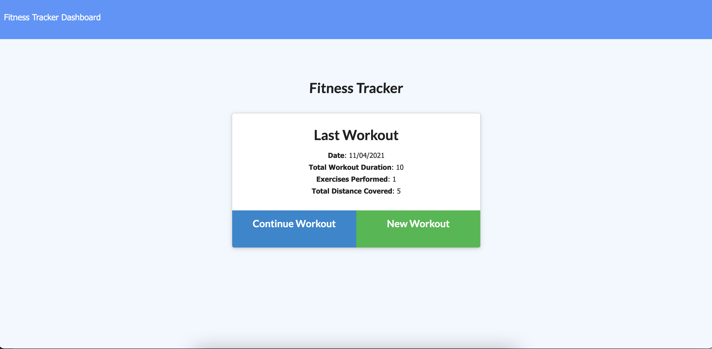
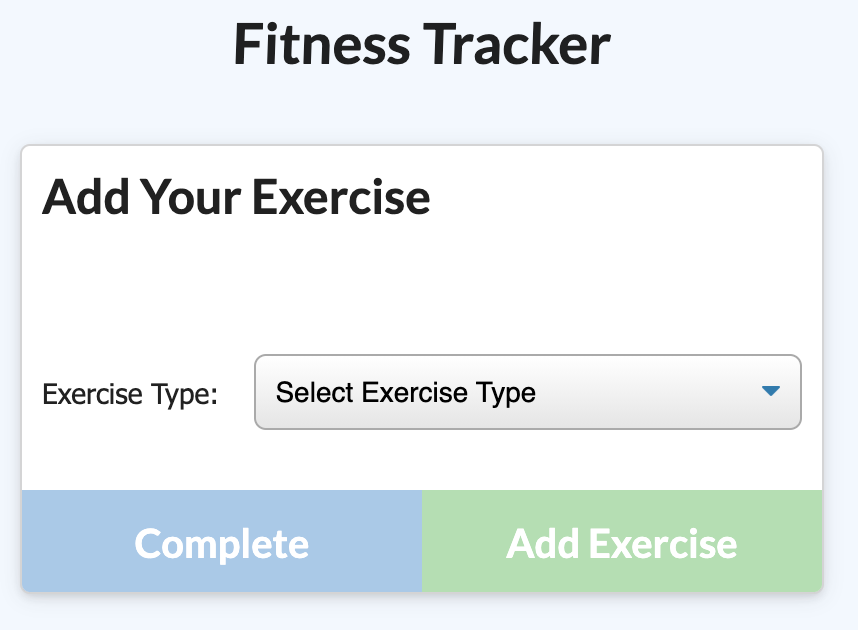
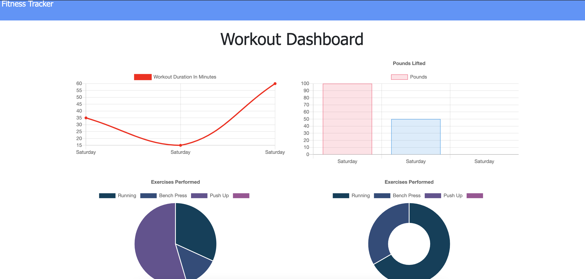

# Workout-Tracker

## Description

This is a full stack web application designed to help those wanting to track their fitness by recording workouts. 
It is simple to navigate from Homepage with the ability to add to their last workout or create a new one to their current list of exercises.
As well as this, they can view their stats via the dashboard. 

## How to use

_WHEN on the homepage, select create new or add to last workout._

_THEN on the exercise page, select from either cardio or resistance workout and proceed to fill in the specifications._

_THEN you can select select whether you'd like to complete the exercise and return to the homepage or add another exercise._

_THEN you can visit the Dashboard to view the stats of your last seven workouts._

## Links
[Heroku](https://guarded-gorge-79785.herokuapp.com/)

[GitHub Pages](https://ffakih5.github.io/-Workout-Tracker/)

## Built with
- <b>Chart.js</b>
- <b>CSS</b>
- <b>Express</b>
- <b>HTML</b>
- <b>JavaScript</b>
- <b>Mongo DB Atlast</b>
- <b>Mongoose</b>
- <b> Node.js</b>

## App in action

[Workout-Tracker-Walkthrough](https://drive.google.com/file/d/1YeSCSvPyEZZ4ZO3TVF9hoUtPuHJ8BlXs/view?usp=sharing)

